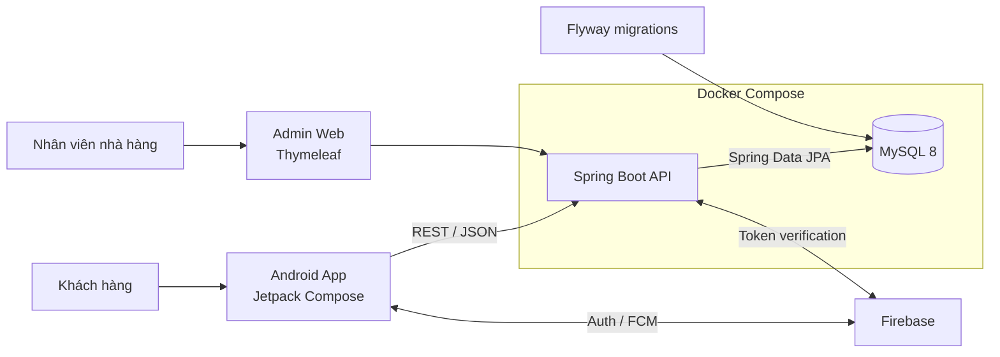

<div align="center">
  

  # The Golden Leaf

  **Nền tảng đặt bàn và gọi món dành cho nhà hàng, kết nối trải nghiệm khách hàng trên Android với hệ thống vận hành tập trung.**

  [](https://developer.android.com/compose)
  [](https://kotlinlang.org/)
  [](https://spring.io/projects/spring-boot)
  [](https://openjdk.org/projects/jdk/17/)
  [](https://www.mysql.com/)
  [](https://docs.docker.com/compose/)

  [Bắt đầu nhanh](#bắt-đầu-nhanh) · [Kiến trúc](#kiến-trúc-hệ-thống) · [API](#api-hiện-có) · [Roadmap](#roadmap) · [Tài liệu](#tài-liệu-kỹ-thuật)
</div>

---

## Tổng quan

The Golden Leaf hướng tới số hóa toàn bộ hành trình dùng bữa: khách hàng xem thực đơn, chọn thời gian và khu vực, đặt bàn, gọi món và theo dõi hóa đơn ngay trên ứng dụng Android; phía nhà hàng có API và giao diện web nền tảng để quản lý thực đơn cùng hoạt động đặt bàn.

Repository được tổ chức theo mô hình monorepo, gồm ứng dụng Android, Spring Boot REST API và hạ tầng MySQL chạy bằng Docker Compose. Schema dữ liệu được quản lý bằng Flyway, contract API được chuẩn hóa bằng DTO và có OpenAPI/Swagger để kiểm thử tích hợp.

> [!NOTE]
> Dự án đang trong giai đoạn phát triển chủ động. Nền tảng build/development và contract dữ liệu/API đã hoàn thành; các ràng buộc đặt bàn, bảo mật production và quy trình vận hành nâng cao đang nằm trong roadmap tiếp theo.

## Trạng thái phát triển

| Hạng mục | Trạng thái | Kết quả |
| --- | :---: | --- |
| Nền tảng phát triển | ✅ Hoàn thành | Build tái lập, Docker Compose, environment template, health check |
| Dữ liệu & API contract | ✅ Hoàn thành | Flyway V1, 17 bảng nghiệp vụ, DTO, lỗi API chuẩn, Swagger |
| Luồng đặt bàn an toàn | 🚧 Tiếp theo | Transaction, chống đặt trùng, idempotency, kiểm thử concurrency |
| Xác thực & phân quyền | 📋 Kế hoạch | Firebase bắt buộc ở production, ownership và role-based access |
| Thông báo & vận hành | 📋 Kế hoạch | FCM outbox, audit log, dashboard và quan sát hệ thống |
| Production readiness | 📋 Kế hoạch | CI/CD, backup, monitoring, hardening và runbook triển khai |

## Tính năng cốt lõi

### Trải nghiệm khách hàng

- Duyệt thực đơn và xem thông tin món ăn.
- Chọn ngày, khung giờ và khu vực ngồi.
- Tạo yêu cầu đặt bàn và thêm món vào đơn.
- Xem thông tin hóa đơn và phương thức thanh toán.
- Giao diện Android hiện đại xây dựng bằng Jetpack Compose.
- Tích hợp nền tảng Firebase cho xác thực và thông báo.

### Vận hành nhà hàng

- Quản lý thực đơn qua giao diện Thymeleaf nền tảng.
- Theo dõi dữ liệu bàn, khung giờ, đặt bàn và hóa đơn.
- API dành cho thao tác đặt bàn, đặt món và trả bàn.
- Database migration có phiên bản, dễ tái tạo trên môi trường mới.
- Health check và tài liệu API phục vụ triển khai, tích hợp.

## Kiến trúc hệ thống



Luồng dữ liệu chính:

1. Ứng dụng xác thực người dùng qua Firebase và gửi token khi backend bật chế độ bảo vệ.
2. Android gọi REST API bằng Retrofit; backend xác thực, kiểm tra nghiệp vụ và trả DTO ổn định.
3. Spring Data JPA truy cập MySQL; Flyway là nguồn duy nhất quản lý thay đổi schema.
4. Swagger UI mô tả contract thực tế để mobile, backend và QA cùng kiểm tra.

## Công nghệ sử dụng

| Khu vực | Công nghệ chính |
| --- | --- |
| Android | Kotlin 2.0.21, Jetpack Compose, Material 3, Navigation Compose |
| Kiến trúc mobile | ViewModel, StateFlow, Coroutines, Hilt |
| Kết nối mobile | Retrofit 2, OkHttp 4, Gson, Kotlin Serialization |
| Backend | Java 17, Spring Boot 3.5.6, Spring Web, Validation, Security |
| Dữ liệu | Spring Data JPA, MySQL 8, Flyway, H2 cho test |
| Dịch vụ | Firebase Authentication, Firebase Cloud Messaging |
| API & vận hành | OpenAPI 3, Swagger UI, Spring Boot Actuator |
| Hạ tầng local | Docker, Docker Compose, phpMyAdmin tùy chọn |

## Cấu trúc repository

```text
The-Golden-Leaf/
├── app/                         # Ứng dụng Android Jetpack Compose
│   └── src/main/java/...        # UI, ViewModel, repository, network
├── The-Golden-Leaf-server/      # Spring Boot backend
│   ├── src/main/java/...        # Controller, service, repository, model
│   ├── src/main/resources/
│   │   ├── db/migration/        # Flyway migrations
│   │   └── templates/           # Giao diện quản trị Thymeleaf
│   ├── Dockerfile
│   └── docker-compose.yml
├── docs/
│   ├── api-contract.md          # REST contract và quy ước lỗi
│   └── database-schema.md       # Thiết kế database
├── build.gradle.kts             # Cấu hình Gradle cấp project
└── local.properties.example     # Mẫu cấu hình Android SDK
```

## Bắt đầu nhanh

### Yêu cầu môi trường

- Git.
- JDK 17.
- Android Studio và Android SDK 36.
- Docker Desktop nếu chạy backend bằng container.

> [!IMPORTANT]
> Dùng JDK 17 cho cả backend và Gradle Android. Không đưa `.env`, keystore hoặc Firebase service-account JSON thật vào Git.

### 1. Clone repository

```powershell
git clone https://github.com/TrinhQuocDat542005/The-Golden-Leaf.git
cd The-Golden-Leaf
```

### 2. Khởi động backend bằng Docker

```powershell
cd The-Golden-Leaf-server
Copy-Item .env.example .env
docker compose up --build
```

Khi container đã healthy, các dịch vụ mặc định sẽ có tại:

| Dịch vụ | Địa chỉ |
| --- | --- |
| REST API | `http://localhost:8080` |
| Health check | `http://localhost:8080/actuator/health` |
| Swagger UI | `http://localhost:8080/swagger-ui.html` |
| OpenAPI JSON | `http://localhost:8080/v3/api-docs` |
| MySQL từ máy host | `localhost:3308` |

Khởi động thêm phpMyAdmin khi cần quan sát database:

```powershell
docker compose --profile tools up --build
```

phpMyAdmin sẽ chạy tại `http://localhost:8082`.

### 3. Cấu hình và build Android

Quay lại thư mục gốc, tạo cấu hình SDK local:

```powershell
Copy-Item local.properties.example local.properties
```

Sửa `sdk.dir` trong `local.properties` cho đúng Android SDK trên máy. Bản debug mặc định gọi `http://10.0.2.2:8080/`, phù hợp với Android Emulator.

```powershell
# Chỉ cần đổi URL khi chạy trên thiết bị thật hoặc môi trường khác.
$env:API_BASE_URL='http://192.168.1.10:8080/'
$env:WEATHER_API_KEY='your-local-key'
./gradlew.bat assembleDebug
```

Mở project bằng Android Studio và chạy configuration `app` để sử dụng emulator hoặc thiết bị thật.

## Chạy backend không dùng Docker

Khởi động một MySQL instance trước, sau đó chạy:

```powershell
cd The-Golden-Leaf-server
$env:DB_URL='jdbc:mysql://localhost:3308/datban_db?createDatabaseIfNotExist=true&useSSL=false&allowPublicKeyRetrieval=true&serverTimezone=UTC'
$env:DB_USERNAME='datban'
$env:DB_PASSWORD='local-datban-password'
./mvnw.cmd spring-boot:run
```

Backend sử dụng profile `dev` mặc định. Có thể đặt `SPRING_PROFILES_ACTIVE` để chuyển profile.

## Cấu hình môi trường

### Backend

| Biến | Mặc định local | Mô tả |
| --- | --- | --- |
| `SPRING_PROFILES_ACTIVE` | `dev` | Profile Spring đang chạy |
| `DB_URL` | MySQL tại `localhost:3308` | JDBC URL của database |
| `DB_USERNAME` | `datban` | Tài khoản database |
| `DB_PASSWORD` | `local-datban-password` | Mật khẩu database |
| `SERVER_PORT` | `8080` | Port của backend |
| `FIREBASE_ENABLED` | `false` | Khởi tạo Firebase Admin SDK |
| `REQUIRE_AUTH` | `false` | Bắt buộc Bearer token cho API |
| `FIREBASE_CREDENTIALS_PATH` | đường dẫn local | Service-account JSON bên trong runtime |
| `FIREBASE_CREDENTIALS_HOST_PATH` | file mẫu | File được mount vào container |

### Android

| Biến | Mặc định debug | Mô tả |
| --- | --- | --- |
| `API_BASE_URL` | `http://10.0.2.2:8080/` | Base URL cho debug build |
| `PRODUCTION_API_BASE_URL` | Không có | Bắt buộc khi build release |
| `WEATHER_API_KEY` | Chuỗi rỗng | API key cho tính năng thời tiết |

Ví dụ build release:

```powershell
$env:PRODUCTION_API_BASE_URL='https://api.example.com/'
$env:WEATHER_API_KEY='your-production-key'
./gradlew.bat assembleRelease
```

### Spring profiles

| Profile | Database | Firebase/Auth | Mục đích |
| --- | --- | --- | --- |
| `dev` | MySQL | Tắt mặc định | Phát triển local và Docker Compose |
| `test` | H2 in-memory | Tắt | Test tự động, không phụ thuộc dịch vụ ngoài |
| `prod` | Nhận hoàn toàn từ env | Bắt buộc | Môi trường production |

## API hiện có

| Method | Endpoint | Chức năng |
| :---: | --- | --- |
| `POST` | `/api/auth/sync` | Đồng bộ hồ sơ Firebase với backend |
| `GET` | `/api/thucdon` | Lấy danh sách thực đơn |
| `GET` | `/api/thucdon/{id}` | Lấy chi tiết món ăn |
| `GET` | `/api/ban-slot` | Tra cứu bàn theo ngày, giờ và khu vực |
| `POST` | `/api/ban-slot/dat` | Đánh dấu bàn đã đặt |
| `POST` | `/api/ban-slot/tra` | Trả bàn về trạng thái trống |
| `POST` | `/api/datban/save` | Tạo yêu cầu đặt bàn |
| `GET` | `/api/datban/latest` | Lấy đặt bàn gần nhất của người dùng |
| `POST` | `/api/giohang/datmon` | Thêm món vào đơn đặt bàn |
| `POST` | `/api/hoadon/create` | Tạo hóa đơn |

Request, response và schema lỗi chuẩn được mô tả trong [REST API contract](docs/api-contract.md). Khi backend đang chạy, Swagger UI là nguồn tương tác nhanh nhất để thử từng endpoint.

## Database

Các nguyên tắc dữ liệu hiện tại:

- Flyway quản lý phiên bản schema; Hibernate chỉ chạy ở chế độ `validate`.
- Tiền tệ lưu bằng `DECIMAL` trong MySQL và `BigDecimal` trong Java.
- Thời gian được chuẩn hóa theo UTC ở backend và JDBC.
- Khóa ngoại, unique constraint và index phục vụ các truy vấn nghiệp vụ chính.
- Cột version được chuẩn bị cho optimistic locking ở dữ liệu tranh chấp.
- Schema V1 gồm 17 bảng cho người dùng, thực đơn, bàn, đặt bàn, hóa đơn, thanh toán, đánh giá, yêu thích, thông báo và audit.

> [!WARNING]
> Database được tạo từ bản prototype trước khi có Flyway cần được sao lưu rồi migrate hoặc tạo mới trước khi chạy `V1__initial_production_schema.sql`.

Xem đầy đủ tại [tài liệu thiết kế database](docs/database-schema.md).

## Kiểm thử

### Backend

```powershell
cd The-Golden-Leaf-server
./mvnw.cmd test
```

Test backend dùng H2 in-memory nên không yêu cầu MySQL hoặc Firebase bên ngoài.

### Android

```powershell
./gradlew.bat testDebugUnitTest
./gradlew.bat assembleDebug
```

Trước khi mở pull request, nên chạy cả test backend lẫn build Android để phát hiện sớm lỗi contract giữa hai phía.

## Roadmap

- [x] Chuẩn hóa Gradle/Maven wrapper và cấu hình JDK 17.
- [x] Docker hóa backend, MySQL và health check.
- [x] Tách secret khỏi source, bổ sung environment template.
- [x] Thiết lập Flyway V1 và chuẩn hóa kiểu dữ liệu tiền tệ.
- [x] Bổ sung DTO, global error response và OpenAPI/Swagger.
- [ ] Làm luồng đặt bàn nguyên tử, chống double-booking và hỗ trợ idempotency.
- [ ] Hoàn thiện Firebase authentication, ownership và phân quyền khách/nhân viên/admin.
- [ ] Hoàn thiện payment state machine, callback verification và reconciliation.
- [ ] Xây dựng notification outbox, retry và FCM delivery tracking.
- [ ] Bổ sung test service, repository, integration và end-to-end.
- [ ] Thiết lập CI/CD, logging có cấu trúc, metrics, backup và runbook production.

## Tài liệu kỹ thuật

- [REST API contract](docs/api-contract.md) — endpoint, payload, validation và error envelope.
- [Database schema](docs/database-schema.md) — bảng, quan hệ, kiểu dữ liệu và chiến lược migration.
- [Environment template](The-Golden-Leaf-server/.env.example) — biến môi trường dùng với Docker Compose.
- [OpenAPI configuration](The-Golden-Leaf-server/src/main/java/com/example/datban/config/OpenApiConfig.java) — metadata tài liệu API.

## Quy ước đóng góp

1. Tạo branch theo phạm vi thay đổi, ví dụ `feat/booking-integrity` hoặc `fix/invoice-total`.
2. Giữ commit nhỏ, có chủ đích và sử dụng Conventional Commits.
3. Không commit secret, file `.env`, service-account JSON hoặc keystore thật.
4. Cập nhật contract/migration khi thay đổi API hoặc database.
5. Chạy test backend và build Android trước khi mở pull request.

Ví dụ commit:

```text
feat(booking): prevent duplicate reservations
fix(invoice): preserve monetary precision
docs(readme): improve project onboarding
```

---

<div align="center">
  <sub>Built with Kotlin, Spring Boot and a focus on reliable restaurant operations.</sub>
  <br />
  <sub>© The Golden Leaf contributors</sub>
</div>
