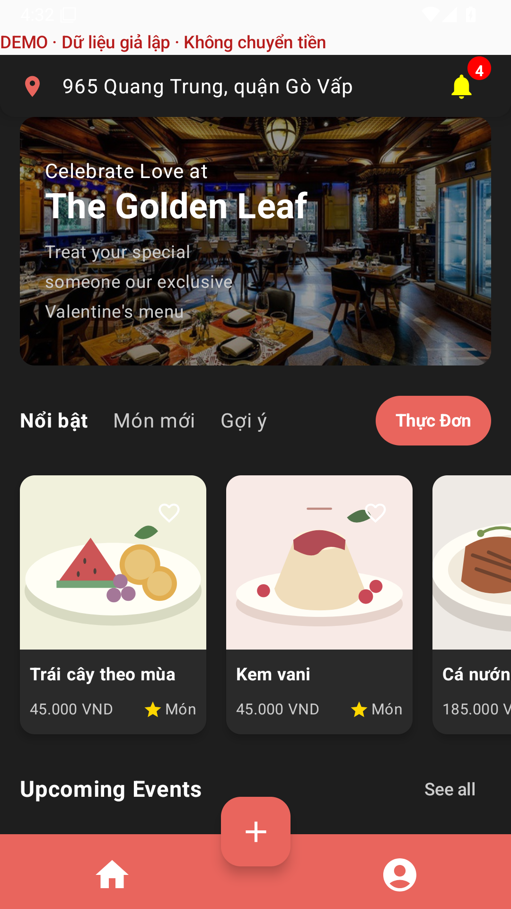
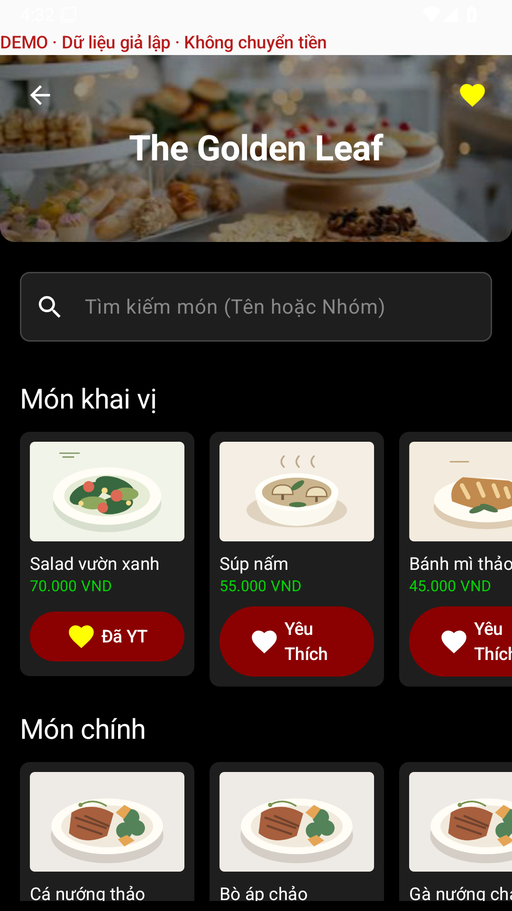
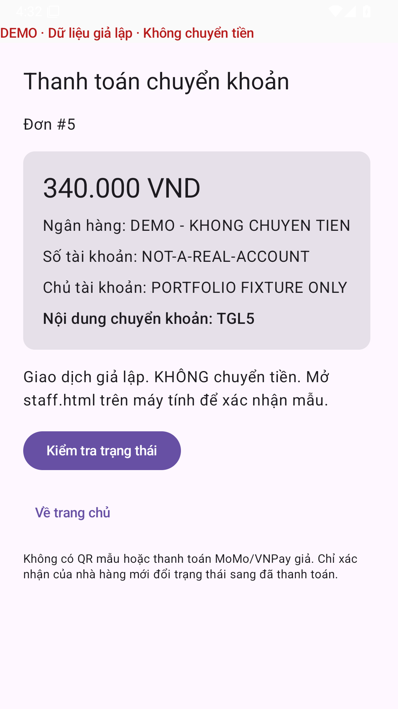
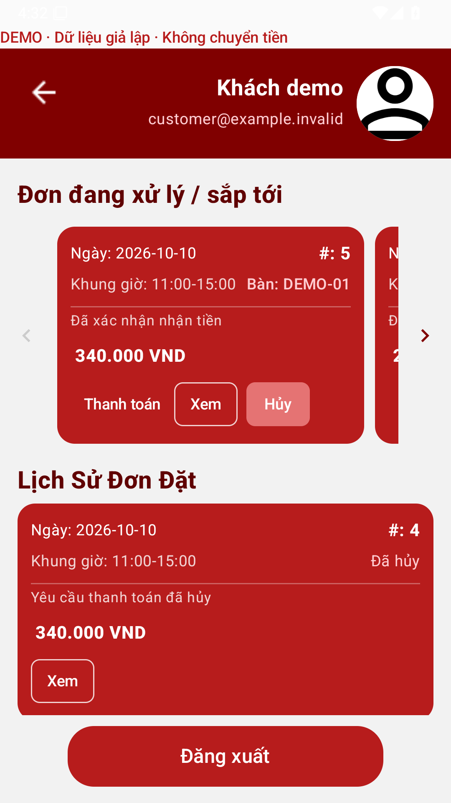
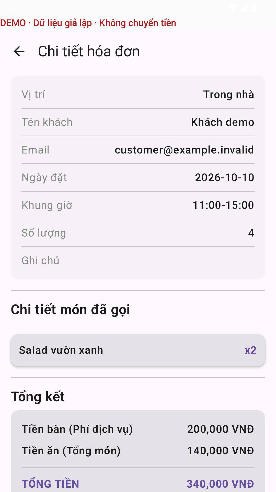
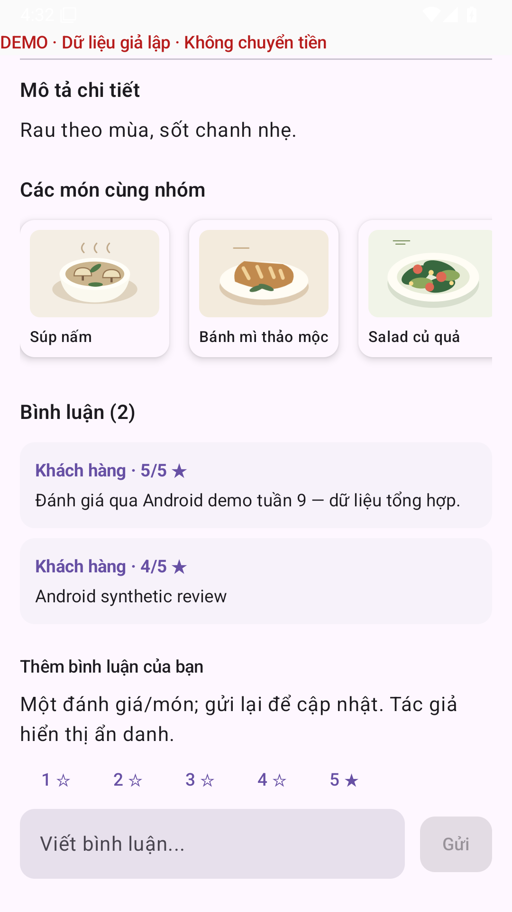
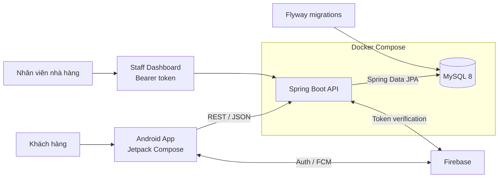

<div align="center">
  

  # The Golden Leaf

  **Ứng dụng đặt bàn và quản lý nhà hàng — Android, Spring Boot và web dashboard.**

  [](https://github.com/TrinhQuocDat542005/The-Golden-Leaf/actions/workflows/ci.yml)

  [](https://developer.android.com/compose)
  [](https://kotlinlang.org/)
  [](https://spring.io/projects/spring-boot)
  [](https://openjdk.org/projects/jdk/17/)
  [](https://www.mysql.com/)
  [](https://docs.docker.com/compose/)

  [Tải demo v0.10.0](https://github.com/TrinhQuocDat542005/The-Golden-Leaf/releases/tag/portfolio-v0.10.0) · [Chạy demo](#2-demo-portfolio-không-cần-secret) · [Ảnh thật](#giao-diện-demo) · [Case study](docs/week-7-portfolio.md#case-study-ngắn-cho-người-review) · [API](#api-hiện-có) · [Tài liệu](#tài-liệu-kỹ-thuật)
</div>

---

## Tổng quan

The Golden Leaf là dự án cá nhân về đặt bàn và quản lý nhà hàng. Khách dùng ứng dụng Android để xem thực đơn, đặt bàn, gọi món và theo dõi hóa đơn. Nhân viên dùng dashboard web để xác nhận chuyển khoản, phân bàn và cập nhật trạng thái phục vụ.

Backend xử lý giữ chỗ, chống đặt trùng, tính tiền và phân quyền theo tài khoản. Android và dashboard dùng chung REST API; dữ liệu được quản lý bằng MySQL và Flyway.

> [!NOTE]
> Bản demo chạy local bằng JDK 17, có dữ liệu mẫu và không cần cấu hình Firebase hay MySQL. Không chuyển tiền hoặc gửi push thật. Đây là dự án portfolio, chưa triển khai cho nhà hàng thực tế.

## Giao diện demo

[Tải demo v0.10.0](https://github.com/TrinhQuocDat542005/The-Golden-Leaf/releases/tag/portfolio-v0.10.0), gồm APK Android, backend JAR và script khởi động. Bản demo chưa phát hành trên Play Store.

### Android

Demo có 12 món minh họa và hai tài khoản khách để thử đặt bàn, yêu thích, đánh giá và lịch sử đơn. App gọi backend local; thông tin thanh toán là dữ liệu giả.

[Chạy app trong Android Studio](docs/android-demo.md) · [Hướng dẫn bản đóng gói](docs/demo-bundle-guide.md)

Ảnh chụp ứng dụng trên Android Emulator API 35:

<p align="center">
  
  
  
</p>

<details>
  <summary>Lịch sử, hóa đơn và đánh giá — Android native</summary>

  <p>
    
    
    
  </p>
</details>

### Dashboard và web demo

Giao diện khách và dashboard nhân viên trên trình duyệt:


<details>
  <summary>Đơn đặt bàn, dashboard nhân viên và giao diện mobile-width</summary>

  <p></p>
  <p></p>
  <p></p>
</details>

## Tính năng cốt lõi

### Trải nghiệm khách hàng

- Duyệt thực đơn và xem thông tin món ăn.
- Yêu thích riêng theo tài khoản; đánh giá 1–5 sao, cập nhật một đánh giá cho mỗi món, không công khai email/UID.
- Chọn ngày, khung giờ và khu vực ngồi.
- Tạo yêu cầu đặt bàn và thêm món vào đơn.
- Xem hóa đơn tính bởi server và tài khoản chuyển khoản thực tế; theo dõi chờ đối soát, đã thu, chờ hoàn/đã hoàn.
- Lịch sử đơn theo tài khoản và hộp thư thông báo; push FCM khi đã cấu hình.
- Giao diện Android dùng Jetpack Compose; xác thực bằng Firebase ở bản thường.

### Vận hành nhà hàng

- Dashboard `/staff.html`: lọc ngày, chi tiết đơn, phân bàn, nhận khách, hoàn tất và hủy.
- Nhân viên ghi nhận chuyển khoản/hoàn tiền sau khi kiểm tra sao kê; không tự động chuyển tiền.
- Admin quản lý món/ảnh, bàn thực tế, quyền truy cập, khóa tài khoản và xem audit.
- Đồng bộ sức chứa với bàn thực tế, bảo toàn chỗ đang giữ; theo dõi và thử lại push lỗi.

## Kiến trúc hệ thống



Luồng dữ liệu chính:

1. Ứng dụng xác thực qua Firebase và gửi ID token; production bắt buộc token hợp lệ, email xác minh và tài khoản đang hoạt động.
2. Android gọi REST API bằng Retrofit; backend xác thực, kiểm tra nghiệp vụ và trả DTO ổn định.
3. Spring Data JPA truy cập MySQL; Flyway là nguồn duy nhất quản lý thay đổi schema.
4. Swagger UI mô tả contract thực tế để mobile, backend và QA cùng kiểm tra.

## Công nghệ sử dụng

| Khu vực | Công nghệ chính |
| --- | --- |
| Android | Kotlin 2.0.21, Jetpack Compose, Material 3, Navigation Compose |
| Kiến trúc mobile | ViewModel, StateFlow, Coroutines, Hilt |
| Kết nối mobile | Retrofit 2, OkHttp 4, Gson, Kotlin Serialization |
| Backend | Java 17, Spring Boot 3.5.16, Spring Web, Validation, Security |
| Dữ liệu | Spring Data JPA, MySQL 8, Flyway, H2 cho test |
| Dịch vụ | Firebase Authentication, Firebase Cloud Messaging |
| API & vận hành | OpenAPI 3, Swagger UI, Spring Boot Actuator |
| Hạ tầng local | Docker, Docker Compose, phpMyAdmin tùy chọn |

## Cấu trúc repository

```text
The-Golden-Leaf/
├── app/                         # Ứng dụng Android Jetpack Compose
│   └── src/main/java/...        # UI, ViewModel, repository, network
├── The-Golden-Leaf-server/      # Spring Boot backend
│   ├── src/main/java/...        # Controller, service, repository, model
│   ├── src/main/resources/
│   │   ├── db/migration/        # Flyway migrations
│   │   ├── static/staff.*      # Dashboard nhân viên/admin
│   │   └── templates/           # Giao diện quản trị Thymeleaf
│   ├── Dockerfile
│   └── docker-compose.yml
├── docs/
│   ├── api-contract.md          # REST contract và quy ước lỗi
│   ├── database-schema.md       # Thiết kế database
│   ├── week-7-portfolio.md      # Demo, case study và script trình diễn
│   └── assets/                 # Screenshot thật từ browser test
├── tools/demo-browser/         # Playwright E2E, video/report
├── ops/                        # Production/backup templates (không auto-deploy)
├── .github/workflows/           # Backend/Android/infrastructure/demo CI
├── build.gradle.kts             # Cấu hình Gradle cấp project
└── local.properties.example     # Mẫu cấu hình Android SDK
```

## Bắt đầu nhanh

### Yêu cầu môi trường

- Git.
- JDK 17.
- **Demo web/API:** chỉ Git và JDK 17. Lần build đầu cần Internet.
- **Android riêng:** Android Studio và Android SDK 36.
- **Development MySQL/kiểm tra hạ tầng:** Docker Desktop nếu chạy bằng container.

> [!IMPORTANT]
> Dùng JDK 17 cho cả backend và Gradle Android. Không đưa `.env`, keystore hoặc Firebase service-account JSON thật vào Git.

### 1. Clone repository

```powershell
git clone https://github.com/TrinhQuocDat542005/The-Golden-Leaf.git
cd The-Golden-Leaf
```

### 2. Demo portfolio không cần secret

```powershell
cd The-Golden-Leaf-server
./mvnw.cmd spring-boot:run '-Dspring-boot.run.profiles=demo'
```

Linux/macOS: `bash mvnw spring-boot:run -Dspring-boot.run.profiles=demo` trong thư mục backend.

Mở **[http://127.0.0.1:8080/demo.html](http://127.0.0.1:8080/demo.html)**. Chọn ngày mai, 4 khách và 2 salad → tạo đơn → xác nhận → tạo payment demo. Tổng mẫu **340.000 VND** do server tính. Mở `/staff.html` ở tab khác, chọn persona nhân viên để đối soát/phân bàn; admin xem audit. Không cần mật khẩu hay Firebase.

DB tạm có 12 món và 7 hình minh họa SVG local, 4 bàn 8 ghế, 28 slots, 4 tài khoản `.invalid`, một đơn hôm nay và lịch sử hoàn tất/hủy để thử. Restart backend để reset. Không chuyển tiền, không gửi FCM, không ghi/serve uploads local. Demo chỉ bind loopback và từ chối trộn profile/DB thật.

**Chạy bản đóng gói, không cần Maven/Gradle:** tải [golden-leaf-portfolio-demo.zip](https://github.com/TrinhQuocDat542005/The-Golden-Leaf/releases/download/portfolio-v0.10.0/golden-leaf-portfolio-demo.zip) và [RELEASE-SHA256SUMS](https://github.com/TrinhQuocDat542005/The-Golden-Leaf/releases/download/portfolio-v0.10.0/RELEASE-SHA256SUMS). So SHA-256 của ZIP với dòng tương ứng trong checksum, giải nén vào thư mục mới rồi chạy:

```powershell
# Windows — trong thư mục đã giải nén; cần JDK 17.
Get-Content REVISION
./Verify-Demo.ps1
./Start-Demo.ps1
```

Linux/macOS: `bash Start-Demo.sh`. Script đã được thử trên Linux, chưa thử trên macOS. Nếu Windows chặn script, xem [hướng dẫn](docs/demo-bundle-guide.md); không cần tắt execution policy của máy.

Mở `http://127.0.0.1:8080/demo.html`. Để thử Android, cài `golden-leaf-demo.apk` trong ZIP vào emulator API 25+ và giữ backend trên **8080**. APK kết nối qua `http://10.0.2.2:8080/`, nên backend phải đang chạy. Có thể tải riêng [APK](https://github.com/TrinhQuocDat542005/The-Golden-Leaf/releases/download/portfolio-v0.10.0/golden-leaf-demo.apk) hoặc [JAR](https://github.com/TrinhQuocDat542005/The-Golden-Leaf/releases/download/portfolio-v0.10.0/golden-leaf-demo.jar); bản riêng không kèm script kiểm tra checksum và hạn bảo mật.

> [!WARNING]
> Bản v0.10.0 còn hai CVE Spring WebMVC chưa vá, chỉ dùng cho demo local đến **08/11/2026 00:00 UTC**. Script khởi động chặn sau hạn; APK và lệnh Java trực tiếp không có kiểm tra này. Không triển khai public hoặc nhập dữ liệu/thanh toán thật. Chi tiết trong [SECURITY.md](SECURITY.md).

Muốn build app từ source, chọn variant **`demo`** theo [Android demo guide](docs/android-demo.md). Bản `debug`/`release` thường vẫn cần Firebase.

### 3. Development backend bằng Docker (tùy chọn)

```powershell
# Chạy từ thư mục backend; không cần bước này nếu chỉ xem demo H2.
Copy-Item .env.example .env
docker compose up --build
```

Khi container đã healthy, các dịch vụ mặc định sẽ có tại:

| Dịch vụ | Địa chỉ |
| --- | --- |
| REST API | `http://localhost:8080` |
| Health check | `http://localhost:8080/actuator/health` |
| Dashboard nhân viên | `http://localhost:8080/staff.html` (cần cấu hình Firebase và quyền) |
| Swagger UI | `http://localhost:8080/swagger-ui.html` |
| OpenAPI JSON | `http://localhost:8080/v3/api-docs` |
| MySQL từ máy host | `localhost:3308` |

Khởi động thêm phpMyAdmin khi cần quan sát database:

```powershell
docker compose --profile tools up --build
```

phpMyAdmin sẽ chạy tại `http://localhost:8082`.

### 4. Cấu hình và build Android (tùy chọn)

Quay lại thư mục gốc, tạo cấu hình SDK local:

```powershell
Copy-Item local.properties.example local.properties
```

Sửa `sdk.dir` trong `local.properties` cho đúng Android SDK trên máy. Bản debug mặc định gọi `http://10.0.2.2:8080/`, phù hợp với Android Emulator.

```powershell
# Chỉ cần đổi URL khi chạy trên thiết bị thật hoặc môi trường khác.
$env:API_BASE_URL='http://192.168.1.10:8080/'
$env:WEATHER_API_KEY='your-local-key'
./gradlew.bat assembleDebug
```

Mở project bằng Android Studio và chạy configuration `app` để sử dụng emulator hoặc thiết bị thật.

**Thử Android không cần Firebase:** bật backend profile `demo`, chọn Build Variant **`demo`** rồi chạy trên emulator. APK riêng có hai tài khoản khách và dữ liệu tổng hợp, không nhận tiền. Xem [Android demo guide](docs/android-demo.md); `assembleDemo` xuất `app-demo.apk` (không dùng `app-debug.apk` để đăng nhập mẫu).

## Chạy backend không dùng Docker

Khởi động một MySQL instance trước, sau đó chạy:

```powershell
cd The-Golden-Leaf-server
$env:DB_URL='jdbc:mysql://localhost:3308/datban_db?createDatabaseIfNotExist=true&useSSL=false&allowPublicKeyRetrieval=true&serverTimezone=UTC'
$env:DB_USERNAME='datban'
$env:DB_PASSWORD='local-datban-password'
./mvnw.cmd spring-boot:run
```

Backend sử dụng profile `dev` mặc định. Có thể đặt `SPRING_PROFILES_ACTIVE` để chuyển profile.

## Cấu hình môi trường

### Backend

| Biến | Mặc định local | Mô tả |
| --- | --- | --- |
| `SPRING_PROFILES_ACTIVE` | `dev` | Profile Spring đang chạy |
| `DB_URL` | MySQL tại `localhost:3308` | JDBC URL của database |
| `DB_USERNAME` | `datban` | Tài khoản database |
| `DB_PASSWORD` | `local-datban-password` | Mật khẩu database |
| `SERVER_PORT` | `8080` | Port của backend |
| `FIREBASE_ENABLED` | `false` | Khởi tạo Firebase Admin SDK |
| `REQUIRE_AUTH` | `false` | Bắt buộc Bearer token cho API |
| `BOOKING_HOLD_DURATION` | `PT15M` | Thời gian giữ chỗ |
| `RESTAURANT_TIME_ZONE` | `Asia/Ho_Chi_Minh` | Múi giờ nhà hàng |
| `BOOKING_TABLE_FEE` | `200000.00` | Phí bàn trên mỗi đơn |
| `FIREBASE_CREDENTIALS_PATH` | đường dẫn local | Service-account JSON bên trong runtime |
| `FIREBASE_CREDENTIALS_HOST_PATH` | file mẫu | File được mount vào container |
| `FIREBASE_WEB_API_KEY` | Rỗng | Firebase Web API key cho đăng nhập dashboard, cùng project Android/Admin SDK |
| `PAYMENT_BANK_NAME` | Rỗng | Tên ngân hàng thực tế của nhà hàng |
| `PAYMENT_ACCOUNT_NUMBER` | Rỗng | Số tài khoản nhận tiền |
| `PAYMENT_ACCOUNT_NAME` | Rỗng | Chủ tài khoản nhận tiền |
| `MONITORING_TOKEN` | Rỗng | Bearer riêng ≥32 ký tự cho private Prometheus, không cấp quyền business |
| `PUSH_DELIVERY_ENABLED` | `true` | Tắt trên rehearsal DB restore để không gửi push thật |

Các API payment/inbox/lịch sử/nhân viên/admin **luôn yêu cầu xác thực**, kể cả khi `REQUIRE_AUTH=false`. Chế độ này chỉ giữ tương thích development cho một số API cũ; không dùng công khai. Để trống cấu hình ngân hàng sẽ chặn tạo yêu cầu thanh toán mới, không trả tài khoản/QR mẫu.

### Android

| Biến | Mặc định debug | Mô tả |
| --- | --- | --- |
| `API_BASE_URL` | `http://10.0.2.2:8080/` | Base URL cho debug build |
| `PRODUCTION_API_BASE_URL` | Không có | Bắt buộc khi build release |
| `WEATHER_API_KEY` | Chuỗi rỗng | API key cho tính năng thời tiết |

Ví dụ build release:

```powershell
$env:PRODUCTION_API_BASE_URL='https://api.example.com/'
$env:WEATHER_API_KEY='your-production-key'
./gradlew.bat assembleRelease
```

### Spring profiles

| Profile | Database | Firebase/Auth | Mục đích |
| --- | --- | --- | --- |
| `dev` | MySQL | Tắt mặc định | Phát triển local và Docker Compose |
| `test` | H2 in-memory | Tắt | Test tự động, không phụ thuộc dịch vụ ngoài |
| `demo` | H2 memory riêng, không đổi URL | Persona mẫu; Firebase/push tắt, auth/roles vẫn bật | Portfolio local-only, không trộn profile |
| `prod` | Nhận hoàn toàn từ env | Bắt buộc | Môi trường production |

## API hiện có

| Method | Endpoint | Chức năng |
| :---: | --- | --- |
| `POST` | `/api/auth/sync` | Đồng bộ hồ sơ Firebase với backend |
| `GET` | `/api/thucdon` | Lấy danh sách thực đơn |
| `GET` | `/api/thucdon/{id}` | Lấy chi tiết món ăn |
| `GET` | `/api/ban-slot` | Tra cứu bàn theo ngày, giờ và khu vực |
| `GET / POST / DELETE` | `/api/yeu-thich/list`, `/add`, `/remove` | Danh sách/thêm/xóa yêu thích của principal, không nhận quyền từ client UID |
| `GET / POST` | `/api/binhluan/{id}`, `/api/binhluan/add` | Đọc đánh giá ẩn danh / cập nhật điểm 1–5 và nội dung có giới hạn |
| `POST` | `/api/datban/save` | Tạo đơn và giữ sức chứa, cần `Idempotency-Key` |
| `GET` | `/api/datban/{id}` | Đọc đúng đơn đặt bàn theo ID |
| `POST` | `/api/datban/{id}/confirm` | Xác nhận đặt bàn, đóng băng giỏ hàng |
| `POST` | `/api/datban/{id}/cancel` | Hủy đơn và trả sức chứa đúng một lần |
| `GET` | `/api/datban/latest` | Lấy đặt bàn gần nhất của người dùng |
| `PUT` | `/api/giohang/{idDat}` | Thay thế toàn bộ giỏ hàng, có thể rỗng |
| `POST` | `/api/giohang/datmon` | API cũ, nay thay thế toàn bộ giỏ hàng |
| `POST` | `/api/hoadon/create` | Tạo hóa đơn |
| `GET` | `/api/payments/bookings/{id}/quote` | Xem tổng tiền từ server, không tạo hóa đơn/thanh toán |
| `POST` | `/api/payments/bookings/{id}` | Tạo/replay yêu cầu chuyển khoản |
| `GET` | `/api/notifications` | Inbox riêng của tài khoản |
| `GET` | `/api/staff/bookings` | Hàng đợi vận hành STAFF/ADMIN |
| `POST` | `/api/staff/bookings/{id}/verify-payment` | Ghi nhận tiền thực nhận theo sao kê |

Request, response và schema lỗi chuẩn được mô tả trong [REST API contract](docs/api-contract.md). Khi backend đang chạy, Swagger UI là nguồn tương tác nhanh nhất để thử từng endpoint.

Hai API sửa sức chứa trực tiếp `/api/ban-slot/dat` và `/api/ban-slot/tra` đã được ngừng thao tác dữ liệu; chúng trả `409 BOOKING_REQUIRED`. Giữ/trả chỗ phải đi qua lifecycle của đơn. Xác nhận đặt bàn hoặc tạo hóa đơn chưa phải xác nhận thanh toán.

## Database

Các nguyên tắc dữ liệu hiện tại:

- Flyway quản lý phiên bản schema; Hibernate chỉ chạy ở chế độ `validate`.
- Tiền tệ lưu bằng `DECIMAL` trong MySQL và `BigDecimal` trong Java.
- Thời gian được chuẩn hóa theo UTC ở backend và JDBC.
- Khóa ngoại, unique constraint và index phục vụ các truy vấn nghiệp vụ chính.
- Cột version được chuẩn bị cho optimistic locking ở dữ liệu tranh chấp.
- Schema V1 gồm 17 bảng cho người dùng, thực đơn, bàn, đặt bàn, hóa đơn, thanh toán, đánh giá, yêu thích, thông báo và audit.
- V2 bảo vệ booking; V3 bổ sung mã đối soát/hoàn tiền và outbox delivery; V4 lưu snapshot tài khoản nhận tiền. Không sửa migration đã áp dụng.

> [!WARNING]
> Database được tạo từ bản prototype trước khi có Flyway cần được sao lưu rồi migrate hoặc tạo mới trước khi chạy `V1__initial_production_schema.sql`.

Xem đầy đủ tại [tài liệu thiết kế database](docs/database-schema.md).

## Kiểm thử

### Backend

```powershell
cd The-Golden-Leaf-server
./mvnw.cmd test
```

Test mặc định dùng H2 in-memory, không cần Firebase. Test MySQL dùng schema riêng trong CI; khi chưa cấu hình MySQL local, các test này được bỏ qua.

### Browser E2E

```powershell
cd The-Golden-Leaf-server
./mvnw.cmd verify
cd ../tools/demo-browser
npm ci
npx playwright install chromium
npm test
```

JDK 17 + Node 24; lần đầu cần tải Chromium. Test tự khởi động JAR với demo tại port 18082, không mock API, không reuse server khác, và kiểm customer/staff/admin journey + mobile-width. HTML report/video có trong artifact **demo-browser-report-and-video** của CI. [Hướng dẫn chụp lại screenshot và trình diễn](docs/week-7-portfolio.md).

### Android

```powershell
./gradlew.bat testDebugUnitTest
./gradlew.bat assembleDebug
./gradlew.bat lintDebug
node scripts/check-android-quality.mjs
```

Trước khi mở pull request, nên chạy cả test backend lẫn build Android để phát hiện sớm lỗi contract giữa hai phía.

Ở [CI của v0.10.0](https://github.com/TrinhQuocDat542005/The-Golden-Leaf/actions/runs/37958479705): 191 backend tests, 48 Android unit tests, 3 browser E2E và 14 test cho các script kiểm tra. Android Emulator API 25/35 chạy 8 test mỗi API, gồm đặt bàn/thanh toán, yêu thích/đánh giá, đổi tài khoản và tải lại ảnh. Lint còn 94 warnings và 8 hints, không có errors. Chưa thử trên điện thoại thật hoặc với Firebase/FCM và giao dịch thật.

## Tài liệu kỹ thuật

- [REST API contract](docs/api-contract.md) — endpoint, payload, validation và error envelope.
- [Database schema](docs/database-schema.md) — bảng, quan hệ, kiểu dữ liệu và chiến lược migration.
- [Đặt bàn và giữ chỗ](docs/week-3-booking-integrity.md) — trạng thái đơn, transaction và kiểm thử đồng thời.
- [Phân quyền và vận hành](docs/weeks-4-5-security-operations.md) — xác thực, đối soát chuyển khoản và thông báo.
- [Triển khai và backup](docs/week-6-production-readiness.md) — cấu hình HTTPS, metrics, backup và rollback.
- [Kịch bản demo](docs/week-7-portfolio.md) — cách chạy và thử các luồng khách/nhân viên/admin.
- [Android demo](docs/android-demo.md) — build variant, dữ liệu mẫu và kết nối backend local.
- [Báo cáo kiểm thử](docs/week-10-portfolio-release.md) — kết quả CI và giới hạn của bản v0.10.0.
- [Demo bundle guide](docs/demo-bundle-guide.md) — combined APK + JAR, checksum và launcher JDK 17.
- [Contributing](CONTRIBUTING.md) · [Security policy](SECURITY.md) — workflow đóng góp và báo lỗi không lộ dữ liệu.
- [Environment template](The-Golden-Leaf-server/.env.example) — biến môi trường dùng với Docker Compose.
- [OpenAPI configuration](The-Golden-Leaf-server/src/main/java/com/example/datban/config/OpenApiConfig.java) — metadata tài liệu API.

## Quy ước đóng góp

1. Tạo branch theo phạm vi thay đổi, ví dụ `feat/booking-integrity` hoặc `fix/invoice-total`.
2. Giữ commit nhỏ, có chủ đích và sử dụng Conventional Commits.
3. Không commit secret, file `.env`, service-account JSON hoặc keystore thật.
4. Cập nhật contract/migration khi thay đổi API hoặc database.
5. Chạy test backend và build Android trước khi mở pull request.

Ví dụ commit:

```text
feat(booking): prevent duplicate reservations
fix(invoice): preserve monetary precision
docs(readme): improve project onboarding
```

---

<div align="center">
  <sub>Built with Kotlin, Spring Boot and a focus on reliable restaurant operations.</sub>
  <br />
  <sub>© The Golden Leaf contributors</sub>
</div>
