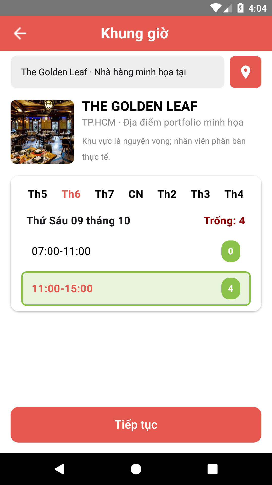
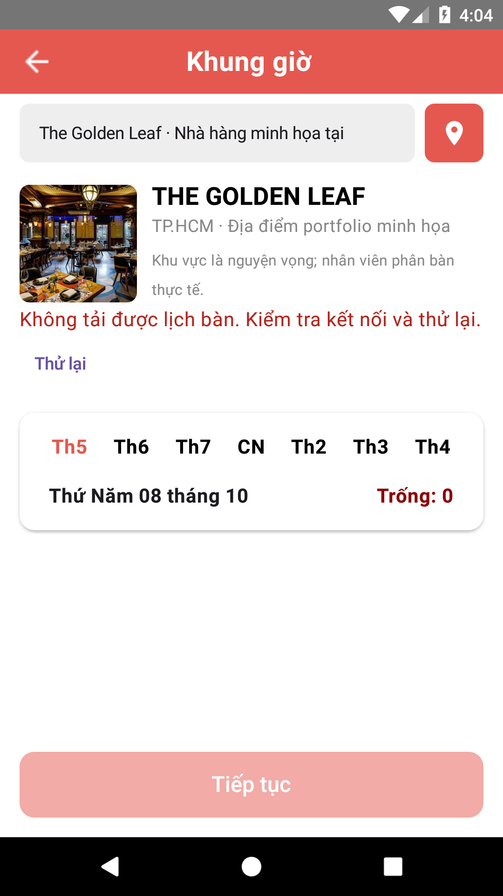
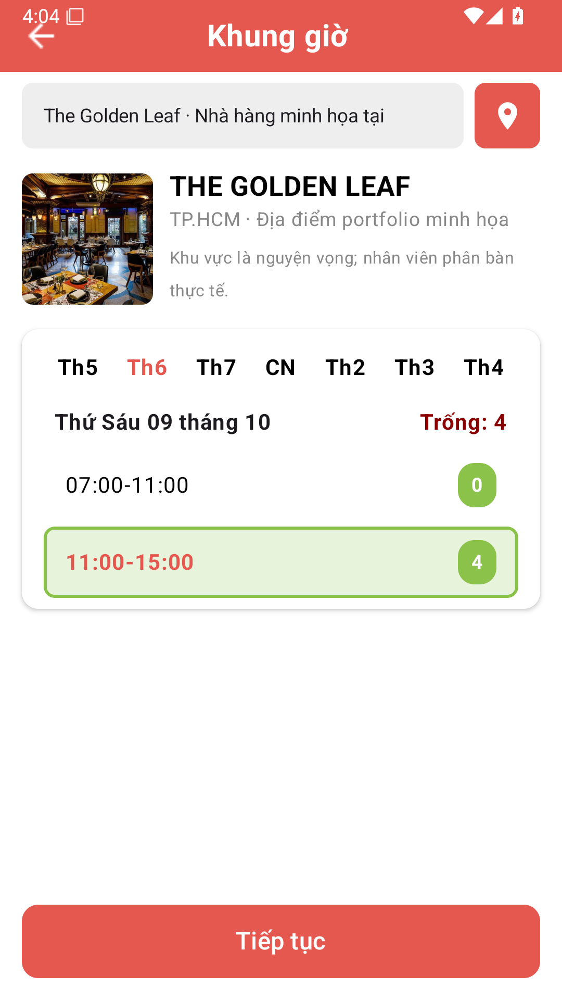
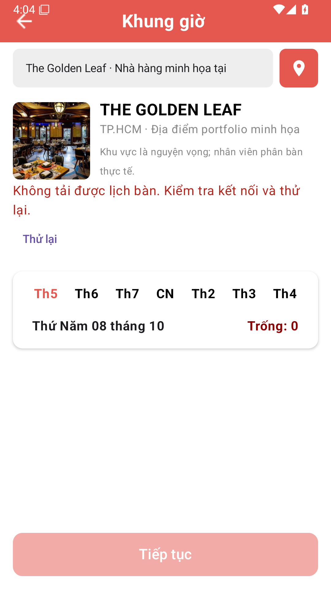

# Tuần 8 — Đóng khoảng trống, regression và quality gates

## Phạm vi và trạng thái

**Tuần 8 đã nghiệm thu trong phạm vi portfolio**, kiểm tra báo cáo và ảnh ngày 09/10/2026. Source revision `7876e776e744001e4c23616a3d490cee766aaeb1` đạt toàn bộ [CI run 37804794761](https://github.com/TrinhQuocDat542005/The-Golden-Leaf/actions/runs/37804794761): backend, Android, infrastructure, security, emulator API 25, emulator API 35 và demo-browser. Mỗi emulator có đúng **4 test events thành công, không skip**, đã đối chiếu raw output/JUnit và kiểm tra hai PNG gốc. Bốn ảnh đều hiển thị nội dung thật, không có frame trắng hoặc dialog che UI.

Không thay đổi source/test/workflow sau revision đã nghiệm thu. Commit chốt báo cáo chỉ cập nhật Markdown và PNG evidence, dùng `[skip ci]` để không chạy lại bộ test không đổi. Các kết quả local bên dưới và lịch sử xử lý CI giữ provenance riêng; trạng thái cuối là CI run nêu trên.

Mục tiêu là hoàn thiện portfolio sau rà soát toàn bộ tuần 1–7, không triển khai dịch vụ nhà hàng thật. Đã commit/push và chạy CI; kết quả mỗi revision phải đọc ở [workflow CI](https://github.com/TrinhQuocDat542005/The-Golden-Leaf/actions/workflows/ci.yml), không suy ra từ build APK. Local Windows không có tăng tốc hypervisor hoạt động, emulator software API 25/36 không boot được tới thiết bị online. Không tự bật Hyper-V/BIOS, không dùng máy thật/tài khoản thật để lách giới hạn này. Nghiệm thu runtime và ảnh Android được thực hiện trên CI Linux/KVM, tách khỏi các số liệu local bên dưới.

Android vẫn dùng Firebase trong application thật. Instrumentation bắt buộc `-Pweek8IsolatedTests=true`: target debug manifest tắt FirebaseInitProvider, test Application kiểm tra chưa có FirebaseApp và không gọi device binding/FCM. Application tối giản trong `androidTest` chỉ dành cho test màn hình Compose và demo API, **không phải chế độ offline demo của app**. Build debug thường/release không tắt provider; không cài bản test-isolated để sử dụng app thật. Ảnh web mobile-width tuần 7 vẫn là ảnh web, không đổi nhãn thành ảnh Android.

## Những khoảng trống đã xử lý

| Khoảng trống | Thay đổi tuần 8 | Bằng chứng |
|---|---|---|
| Android gọi yêu thích/đánh giá nhưng backend thiếu API | Thêm 5 routes; UID lấy từ principal, bỏ quyền từ query `userId` | H2/MySQL: giả UID, isolation, retry, concurrent add, validation |
| Contract đánh giá thiếu điểm, lộ email | Điểm bắt buộc 1–5, 1–2000 ký tự, một review/user/menu, response ẩn danh | Không email/UID; review hidden không tự publish lại |
| Lỗi mạng thành màn hình rỗng hoặc callback sai | State loading/error/retry cho menu/slots/favorites/reviews; giữ draft nếu gửi thất bại | ViewModel failure/retry/duplicate tests |
| Dữ liệu cũ quay lại khi đổi tài khoản | Injectable AccountSession; clear booking/cart/quote/payment và tiền; guard response cũ bằng UID + generation | Test logout/switch và booking A→B→A |
| Ngày đặt theo múi giờ thiết bị, chọn giờ đã bắt đầu | Asia/Ho_Chi_Minh, 7 ngày nhà hàng, loại slot đầy/quá hạn; tick 15 giây và kiểm tra lại lúc bấm | Clock cố định: ngày lệch timezone, exact start, full/malformed/out-of-window |
| Sơ đồ minh họa dễ bị hiểu là chọn bàn thực | Nhãn sức chứa minh họa; phân bàn thật vẫn thuộc STAFF | Không gửi số bàn minh họa thành mã bàn nghiệp vụ |
| Branding/địa chỉ mẫu không nhất quán | The Golden Leaf; thông tin synthetic TP.HCM; weather tùy chọn không chặn đặt bàn | Weather không key không gọi provider; network failure an toàn |
| Google login gọi sync riêng và log dữ liệu nhạy cảm | Đi qua LoginViewModel chung, verified email, busy guard; bỏ log email/UID/token/raw exception | Static log gate và build; **chưa test Firebase live** |
| Android chỉ có contract tests | Thêm 22 tests ViewModel/time/journey, test Compose và Android→demo API | 32 unit tests đạt; native runtime reports và PNG riêng từng API trong CI |
| CI chưa chặn tăng lint debt/chưa scan inventory | Per-issue budget, static log gate, digest-pinned JAR + image scan, exception có expiry | 6 gate unit tests; report inventory đầy đủ cả local và CI |

Không sửa Flyway V1–V4 đã áp dụng. Luồng giữ chỗ 15 phút, idempotency, server price snapshots, đối soát/hoàn tiền thủ công và ownership tuần trước được giữ nguyên.

## Kết quả local ngày 08/10/2026

| Kiểm chứng | Kết quả |
|---|---|
| Maven `verify`, H2 và MySQL 8.0 disposable | **190 tests; 0 failure/error/skip** |
| Android `testDebugUnitTest` | **32 tests; 0 failure/error** |
| Android debug APK + instrumentation APK | Build thành công; debug không phải signed release |
| Android lint + budget + static log privacy | **0 errors, 96 warnings, 8 hints**; budget đạt |
| Chromium browser E2E trên JAR mới | **3/3 đạt**: customer/staff/admin, check-in/complete, mobile-width |
| Node quality/security/native runner gate tests | **6/6 đạt**: lint error/new type/increase, log, inventory, exception scope/expiry, native complete/partial/crash/skip |
| Backup/restore drill | Đạt: DB + uploads mã hóa, DECIMAL, từ chối tampering/wrong-key/nonempty/live-schema |
| Container regression trên image mới | Đạt sau vá OS: non-root/read-only, uploads writable, private metrics, TLS, auth; load 100 requests / concurrency 5 / 0 failures; p95 108 ms (fixture local, không phải benchmark production) |
| Trivy packaged JAR | 209 Java packages; 5 findings giữ nguyên trong JSON; 0 blocking fixable HIGH/CRITICAL sau ngoại lệ bên dưới |
| Trivy Docker image sau vá OS | 143 OS + 209 Java packages; **35 findings (30 OS + 5 Java)** giữ trong JSON; **0 blocking fixable HIGH/CRITICAL** sau ngoại lệ Spring |
| Compose + Android→API instrumentation | **Chưa chạy được**: emulator local offline; không tính vào các test đã đạt |
| GitHub CI cho revision tuần 8 | Đã push theo yêu cầu; đọc đúng SHA và trạng thái các jobs trong workflow, không gộp kết quả từ revisions khác nhau |

Reports local nằm trong các thư mục ignored: `The-Golden-Leaf-server/target/surefire-reports`, `app/build/reports/tests/testDebugUnitTest`, `app/build/reports/lint-results-debug.*`, `tools/demo-browser/playwright-report`, `build/week8/security/*.json`. Không commit dependency cache, image tar, credential hoặc log chứa dữ liệu thật. Các tài liệu tuần 3–7 giữ số liệu lịch sử, không đại diện kết quả hiện tại.

Image đã quét và regression: local tag `golden-leaf:week8-audit`, ID `sha256:8814a00ee09e5ae00b38e1e2325745baacc65cb8d24a1decfc72f141f02dbe8c`. APK cách ly được giữ riêng ở `build/week8/android-isolated/`; không sử dụng bản này như app thật. Manifest build thường có FirebaseInitProvider enabled=true; manifest fixture enabled=false và flag WEEK8_ISOLATED_TESTS=true đã được kiểm tra. Đây là bằng chứng build/merge, chưa phải bằng chứng runtime emulator.

## Chạy lại

### Backend và browser

```powershell
# MYSQL_TEST_URL và MYSQL_TEST_PASSWORD chỉ trỏ schema disposable riêng theo CI.
# Không đặt các biến này vào database đang sử dụng.
cd The-Golden-Leaf-server
./mvnw.cmd -B verify
cd ../tools/demo-browser
npm ci
npx playwright install chromium
npm test
```

Không có fixture MySQL thì các suite opt-in bị skip; phải đọc report, không gọi kết quả đó là H2 + MySQL đầy đủ. Browser tự mở demo tại 18082, không reuse server 8080 đang xem.

### Android và quality gates

```powershell
./gradlew.bat --no-daemon testDebugUnitTest assembleDebug assembleDebugAndroidTest lintDebug
node scripts/check-android-quality.mjs
node --test scripts/check-android-quality.test.mjs scripts/check-security-report.test.mjs scripts/check-android-instrumentation.test.mjs
```

JDK 17, Android SDK platform 36/build-tools 36.0.0; Java time được core-library desugar để tương thích minSdk 25 ([Android documentation](https://developer.android.com/studio/write/java8-support)). Unit tests sử dụng coroutine test dispatcher/Clock và fake repository/session, không cần Firebase account. Một journey gọi production ViewModels với fake ApiService, không gọi đó là HTTP E2E.

Trên Linux runner riêng có KVM và SDK, chạy `ANDROID_TEST_API=25 bash ops/scripts/test-android-emulator.sh`, rồi API 35. Script tạo AVD fixture riêng, demo process riêng 18082, tắt đúng process đã tạo và upload report/log 14 ngày. Không chạy trên server live. Test runner thay application thật để không đăng ký device/push.

Instrumentation gồm hai kịch bản màn hình `NgayGioScreen` thật (slot đầy, Continue, lỗi/retry) và một HTTP journey từ Android tới demo thật (favorite/review/ownership/idempotency/cart/confirm/quote/PENDING/cancel), cộng smoke package/event cards thật. Đây **không phải** full navigation/login/payment UI journey của toàn app. Semantics tests và kiểm tra trực quan bốn screenshot API 25/35 đã đạt ở revision nghiệm thu.

### Lịch sử xử lý CI

Các trạng thái chưa đạt trong phần này là lịch sử ở revisions trước, đã được đóng bằng CI và kiểm tra ảnh của `7876e77` nêu trên.

CI fixture đặt cùng `ANDROID_USER_HOME`/`ANDROID_EMULATOR_HOME`/`ANDROID_AVD_HOME` dưới build directory, tạo AVD bằng path explicit và kiểm tra registry trước boot; không đổi HOME. Điều này xử lý lỗi `Unknown AVD name` từ runner ở lần chạy c5a3c51. Hai test Compose chụp màn hình bằng Android UiAutomation (hỗ trợ cả API 25); script xuất PNG bằng `adb exec-out run-as` vào artifact riêng từng API. Chỉ gọi đây là screenshot đã nghiệm thu sau khi test runtime và kiểm tra ảnh thật đạt, không từ việc build APK.

Lần chạy 1e51d9a đã boot emulator nhưng AGP UTP dừng ở console/test-runner handshake trước khi trả test events. Script dùng native `adb shell am instrument -w -r` với cùng APK/runner/tests để không phụ thuộc UTP console; không bỏ qua test. Gate yêu cầu đúng 4 test events thành công/unique, `OK (4 tests)` và instrumentation completion code -1; crash/failure/skip/partial output phải fail. Lưu raw output và JUnit XML tạo từ các events đã xác minh, cùng logcat cả khi lỗi. Có hai unit tests riêng cho parser native. Đây là thay đổi cách thực thi, chưa phải bằng chứng runtime đã đạt.

[CI e716e5f](https://github.com/TrinhQuocDat542005/The-Golden-Leaf/actions/runs/37797447282) đã đạt backend/Android/infrastructure/security và bốn native tests API 35. Kiểm tra PNG thật phát hiện hộp thoại ANR của Pixel Launcher che màn hình; **không dùng các ảnh đó làm bằng chứng layout đạt**, dù test logic xanh. Fixture chỉ force-stop/disable hai package launcher đã biết trong AVD disposable; không áp dụng lên thiết bị người dùng. Screenshot helper kiểm tra foreground package là app/test app, từ chối system dialog. Thumbnail ảnh sự kiện trang chủ cũng chuyển sang Coil đo kích thước; smoke test render các event cards thật. Phải đọc kết quả revision mới sau các sửa đổi này để nghiệm thu.

Ở revision `1485ad9`, API 35 đạt smoke event cards và HTTP journey nhưng screenshot guard trả accessibility root null. Guard đọc `mCurrentFocus` từ `dumpsys window windows` thay vì phụ thuộc accessibility tree vừa kết nối; focus null/khác app vẫn fail. API 25 ở lượt trước bị hủy khi APK install chưa trả kết quả, không coi đó là native tests đã chạy. Các lệnh install chuyển sang non-streaming với timeout 120 giây mỗi APK; native runner timeout 180 giây, có log tên từng giai đoạn và pipefail. Thời gian chờ có giới hạn, không biến timeout thành success.

[CI 00df85c](https://github.com/TrinhQuocDat542005/The-Golden-Leaf/actions/runs/37801079206) đạt đủ bốn native tests API 25, đã kiểm tra hai PNG không bị system dialog che: slot đầy không chọn được, slot còn bàn bật Continue và lỗi mạng có retry/Continue disabled. API 35 vẫn bị guard chặn vì không tìm thấy focus trong windows-only dump; **không gộp kết quả hai revisions để gọi toàn bộ matrix đạt**. Helper lấy full WindowManager dump để hỗ trợ phần display của Android mới, lưu window diagnostics trong artifact cả khi lỗi. Không bỏ guard hoặc chấp nhận focus null.

### Ảnh native Android đã nghiệm thu

Revision `bf92d55` đã đạt bốn native tests trên cả API 25/35, xác minh lại raw events/JUnit và focus thuộc app. Hai ảnh API 25 và ảnh chọn slot API 35 đạt kiểm tra trực quan; ảnh lỗi mạng API 35 là frame trắng trước khi compositor hiển thị nội dung. Không dùng frame trắng để nghiệm thu. Screenshot helper đợi tối đa 10 giây cho header PrimaryRed thật xuất hiện trong native framebuffer; không crop/retouch hoặc thay ảnh giả. Semantics assertions vẫn giữ nguyên và timeout phải fail.

PNG gốc từ CI run `37804794761`, source revision `7876e776e744001e4c23616a3d490cee766aaeb1`: artifact API 25 ID `11563141996`, API 35 ID `11563496008`. Ảnh được tạo ngày 08/10/2026 và kiểm tra lại ngày 09/10/2026. Không retouch/crop, không phải ảnh web mobile-width. Fixture synthetic Compose component, **không phải toàn bộ navigation/login của app**. Report/log CI giữ 14 ngày; bốn PNG được lưu trong Git để evidence không phụ thuộc thời hạn artifact.

API 25:

 

API 35:

 

## Lint và quyền riêng tư log

Native instrumentation ở revision `6394e9b` đã thực sự chạy đủ bốn tests và phát hiện lỗi, không được tính là nghiệm thu: fixture cart thiếu `tenMon`/`giaMon` bắt buộc, selector ngày tìm số ngày trong khi UI dùng tên thứ, và API 25 hết heap khi decode icon `map.png` 4000×4000 (allocation khoảng 441 MB). Cart fixture lấy dữ liệu menu thật, selector dùng tag ISO date của nút ngày, icon bản đồ đổi sang vector và ảnh thumbnail dùng Coil với kích thước đo được. Assertions và gate đủ bốn tests vẫn giữ nguyên; phải xác nhận lại trên cả hai API.

CI `a366e24` phát hiện deadlock MySQL ở `parallelPaymentCreationProducesOnePayment`, tại truy vấn slot theo date/label `FOR UPDATE`; Android/infrastructure đạt nhưng các job phụ thuộc backend không chạy. Local chưa tái hiện deadlock ngay cả với burst mạnh hơn, nên không coi đã chứng minh nguyên nhân bằng InnoDB deadlock graph. Repository được thu hẹp khóa slot vào đúng primary-key record sau scalar ID lookup (không cache entity trước khóa), vẫn giữ thứ tự slot → booking và READ_COMMITTED. Test được tăng lên 12 đợt × 6 workers cùng barrier, kiểm tra tất cả trả cùng payment ID và chỉ thêm một payment mỗi đơn; không retry/skip test để che lỗi. CI phải xác nhận lại toàn bộ bundle.

`scripts/android-lint-budget.json` khóa số lượng theo từng issue ID: issue mới hoặc số lượng vượt budget làm CI fail; Error/Fatal luôn fail. Budget phản ánh baseline tuần 8, không phải số 93 warnings/7 hints ở tuần 6. Dependency checks thay đổi theo dữ liệu repository nên có thể cần đánh giá diff sau update, không tự tăng budget để bỏ qua lỗi.

Gate chưa phân biệt vị trí/fingerprint cùng loại, nên việc sửa một warning và thêm một warning khác cùng ID có thể vẫn lọt qua; review diff vẫn bắt buộc. Chưa xử lý sạch tài nguyên/icon/dependency warnings legacy. Gate log cho phép Log tag/message tĩnh, từ chối interpolation/biến/raw exception và println/printStackTrace trong Kotlin production source. Đây là static guard, không chứng nhận runtime log không bao giờ chứa dữ liệu cá nhân.

Hiệu chỉnh baseline từ [CI Linux đầu tiên của ea7f28f](https://github.com/TrinhQuocDat542005/The-Golden-Leaf/actions/runs/37789025753): backend/infrastructure/security đạt; Android unit/build/lint đạt nhưng gate phát hiện metadata fresh khác local. Report có **98 warnings / 8 hints**, thêm `OldTargetApi=1` (target 36 vốn giữ nguyên) và `AndroidGradlePluginVersion=2` thay vì 1 (Gradle 8.13 và AGP 8.13.0 vốn giữ nguyên). Budget được hiệu chỉnh chỉ hai mục theo report cùng source revision, không suppress cả issue family, không tự nâng target/major AGP chưa nghiệm thu. Local vẫn 96 warnings/8 hints. Mọi issue type khác hoặc số lượng vượt baseline tiếp tục fail; test tăng OldTargetApi lên 2 phải bị chặn. Đây là calibration khác môi trường có evidence, **không phải đã sửa sạch các warnings**.

## Security gate và ngoại lệ có hạn

Nâng Spring Boot lên 3.5.16, Firebase Admin 9.11.0; overrides Jackson 2.21.7, Netty 4.1.139.Final, Tomcat 10.1.60, HttpCore5 5.4.3. Giữ Java 17 và Spring Boot 3; không nâng major framework chỉ để làm sạch report. H2/MySQL/browser/container regression phải đạt sau update.

CI dùng Trivy 0.75.0 pin digest; JAR scan dùng `rootfs` để thực sự đọc binary JAR, không dùng fs scan rỗng làm bằng chứng. Image scan từ `docker save` tar, không cấp Docker socket cho scanner. Gate yêu cầu Java package inventory và, với image, OS inventory; chặn HIGH/CRITICAL có FixedVersion. Giữ cả findings thấp hơn hoặc chưa có fix trong full report. Image base tags chưa pin digest: CI scan kiểm tra artifact được build mỗi lần, không hứa image bit-for-bit tái lập.

Runtime Dockerfile cập nhật `libssl3` và `libfreetype6` từ Jammy security repositories. OpenSSL `3.0.2-0ubuntu1.30` xử lý [CVE-2026-84782 theo Ubuntu advisory](https://ubuntu.com/security/CVE-2026-84782); không đưa lỗi OS này vào exception Java.

Ngoại lệ duy nhất hiện tại: **CVE-2026-47884**, `org.springframework:spring-webmvc:6.2.19`, hết hạn **08/11/2026 00:00 UTC**. Theo [Spring advisory](https://spring.io/security/cve-2026-47884/), vector cần XsltView và implicit/wildcard view mapping; project hiện không dùng XsltView/XsltViewResolver, legacy MVC dùng tên Thymeleaf explicit. Scanner xếp CRITICAL; advisory gốc xếp MEDIUM. Không chỉnh severity hay xóa finding. Fix OSS ở Spring 7.0.9, fix nhánh 6.2.20 là enterprise-only; ngoại lệ ghi đúng CVE/package/version/rationale/advisory/expiry, source gate từ chối nếu XsltView được đưa vào. Không áp dụng exemption cả framework.

Gate phải fail khi exception hết hạn/phiên bản thay đổi/thiếu inventory; ngày expiry không hợp lệ cũng fail. Source regex chỉ là guard phụ, không thay reachability audit; phải đánh giá lại nếu MVC/view routing thay đổi hoặc trước bất kỳ public deployment. Đây là residual risk của portfolio local, **không phải xác nhận đã vá CVE hoặc an toàn để go-live**.

## Checklist nghiệm thu và bảo trì

- [x] Backend/API, Android ViewModels/UI states, unit/regression và source gates đã triển khai.
- [x] Test APK, CI emulator matrix và test-only application được thêm.
- [x] Instrumentation API 25/35 đạt trên runner KVM; raw events/JUnit xác minh đủ 4 tests mỗi API, bốn screenshot thật đã kiểm tra và lưu trong Git.
- [x] Commit/push theo yêu cầu; backend/Android/infrastructure/emulator/security/browser xanh trên cùng source revision `7876e77`.

Việc bảo trì sau nghiệm thu: trước ngày 08/11/2026 00:00 UTC, reassess Spring exception và update bản vá tương thích, giữ report đầy đủ. Đây vẫn là CVE tồn tại có ngoại lệ giới hạn, không phải đã vá.

Không bắt buộc cho portfolio: hosting/domain, live bank merchant/Firebase/FCM, signed store release, license lựa chọn thay tác giả, GitHub Release công khai. Tuần 8 không thêm gateway hay giao dịch thật.
